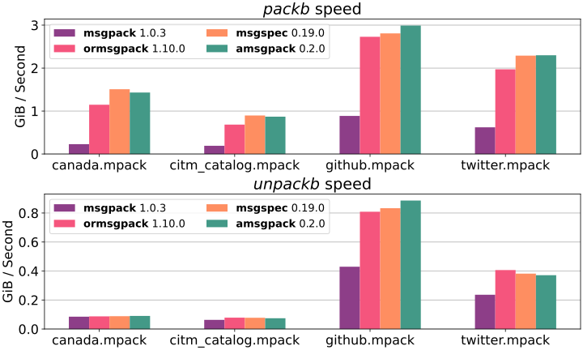

<h1 align="center">

</h1>

## Python MessagePack module

C library for python 3.10+.

Why:
  * I couldn't negotiate adding type hints to [msgpack-python](https://github.com/msgpack/msgpack-python/pull/552)
  * I couldn't negotiate adding Unpacker to [ormsgpack](https://github.com/aviramha/ormsgpack/issues/227)
  * There's no stream unpacking in [msgspec](https://github.com/jcrist/msgspec)
  * I couldn't find another MessagePack library
  * `msgpack-python` interfaces are messy and the library is a bit slow


### Installation
`pip install amsgpack`


### Examples

```Python console
>>> from amsgpack import packb, unpackb
>>> packb({"compact": True, "schema": 0})
b'\x82\xa7compact\xc3\xa6schema\x00'
>>> unpackb(b'\x82\xa7compact\xc3\xa6schema\x00')
{'compact': True, 'schema': 0}
```

```Python console
>>> from amsgpack import FileUnpacker
>>> from io import BytesIO
>>> for data in FileUnpacker(BytesIO(b'\x00\x01\x02')):
...     print(data)
...
0
1
2
```

```Python console
>>> from amsgpack import Unpacker
>>> unpacker = Unpacker()
>>> unpacker.feed(b'\x82\xa7compact\xc3\xa6schema\x00')
>>> next(unpacker)
{'compact': True, 'schema': 0}
```

### Ext Type Packing

When encountering unsupported type a `default` callback is called:

``` python
>>> from typing import Any
>>> from amsgpack import Ext, Packer
>>> from array import array
>>>
>>> def default(value: Any) -> Ext:
...     if isinstance(value, array):
...         return Ext(1, value.tobytes())
...     raise ValueError(f"Unserializable object: {value}")
...
>>> packb = Packer(default=default).packb
>>> packb(array('I', [0xBA, 0xDE]))
b'\xd7\x01\xba\x00\x00\x00\xde\x00\x00\x00'
```

### Ext Type Unpacking

By default when encountering `Ext` type, a conversion to `datetime.datetime`
happens when `code == 1`, otherwise `Ext` instance is returned.

``` python
>>> from amsgpack import Ext, Unpacker
>>> from array import array
>>>
>>> def ext_hook(ext: Ext):
...     if ext.code == 1:
...         return array("I", ext.data)
...     return ext.default()
...
>>> Unpacker(ext_hook=ext_hook).unpackb(
...     b"\xd7\x01\xba\x00\x00\x00\xde\x00\x00\x00"
... )
array('I', [186, 222])
```

### Benchmark


Run `amsgpack_benchmark.py` and then `chart.py` to get your values
