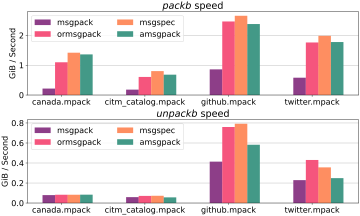

## amsgpack - Python Message Pack module

C library for python 3.10+.

Why:
  * I couldn't negotiate adding type hints to [msgpack-python](https://github.com/msgpack/msgpack-python/pull/552)
  * I couldn't negotiate adding Unpacker to [ormsgpack](https://github.com/aviramha/ormsgpack/issues/227)
  * There's no stream unpacking in [msgspec](https://github.com/jcrist/msgspec)
  * I couldn't find another MessagePack library
  * `msgpack-python` interfaces are messy and the library is a bit slow


### Installation
`pip install amsgpack`


### Examples

```Python console
>>> from amsgpack import packb, unpackb
>>> packb({"compact": True, "schema": 0})
b'\x82\xa7compact\xc3\xa6schema\x00'
>>> unpackb(b'\x82\xa7compact\xc3\xa6schema\x00')
{'compact': True, 'schema': 0}
```

```Python console
>>> from amsgpack import FileUnpacker
>>> from io import BytesIO
>>> for data in FileUnpacker(BytesIO(b'\x00\x01\x02')):
...     print(data)
...
0
1
2
```

```Python console
>>> from amsgpack import Unpacker
>>> unpacker = Unpacker()
>>> unpacker.feed(b'\x82\xa7compact\xc3\xa6schema\x00')
>>> next(unpacker)
{'compact': True, 'schema': 0}
```

### Benchmark


Run `amsgpack_benchmark.py` and then `chart.py` to get your values
